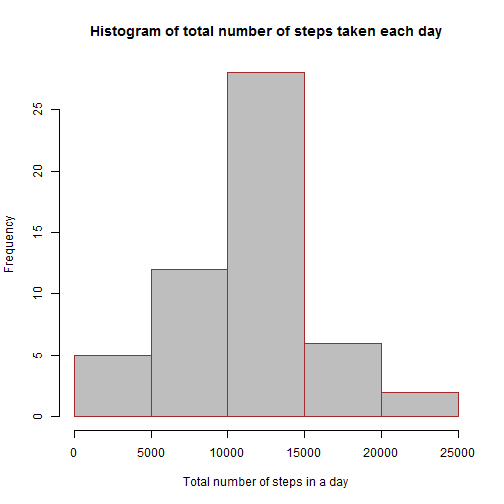
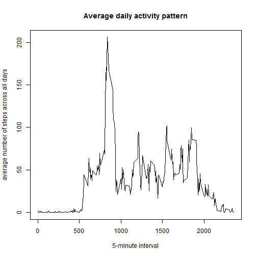
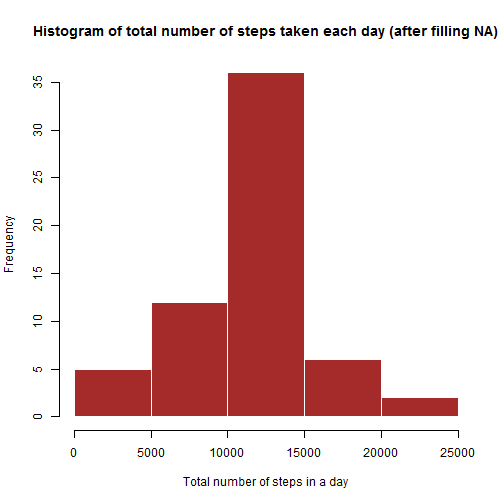

## Loading and preprocessing the data

1.Process/transform the data into a format suitable for the analysis.

```r
data <- read.csv("./data/activity.csv");
```
2.Process/transform the data into a format suitable for your analysis.

```r
data$date <- as.Date(data$date,"%Y-%m-%d")
```

## What is mean total number of steps taken per day?
1.The total number of steps taken per day (8 NA days ignored as requested).

```r
## data$steps <- ifelse(is.na(data$steps)==TRUE,0,data$steps)  ##if we want not to ignore any NA days
ssum <- aggregate(steps~date,data,sum)
names(ssum) <- c("Date","total_steps")
ssum
```

```
##          Date total_steps
## 1  2012-10-02         126
## 2  2012-10-03       11352
## 3  2012-10-04       12116
## 4  2012-10-05       13294
## 5  2012-10-06       15420
## 6  2012-10-07       11015
## 7  2012-10-09       12811
## 8  2012-10-10        9900
## 9  2012-10-11       10304
## 10 2012-10-12       17382
## 11 2012-10-13       12426
## 12 2012-10-14       15098
## 13 2012-10-15       10139
## 14 2012-10-16       15084
## 15 2012-10-17       13452
## 16 2012-10-18       10056
## 17 2012-10-19       11829
## 18 2012-10-20       10395
## 19 2012-10-21        8821
## 20 2012-10-22       13460
## 21 2012-10-23        8918
## 22 2012-10-24        8355
## 23 2012-10-25        2492
## 24 2012-10-26        6778
## 25 2012-10-27       10119
## 26 2012-10-28       11458
## 27 2012-10-29        5018
## 28 2012-10-30        9819
## 29 2012-10-31       15414
## 30 2012-11-02       10600
## 31 2012-11-03       10571
## 32 2012-11-05       10439
## 33 2012-11-06        8334
## 34 2012-11-07       12883
## 35 2012-11-08        3219
## 36 2012-11-11       12608
## 37 2012-11-12       10765
## 38 2012-11-13        7336
## 39 2012-11-15          41
## 40 2012-11-16        5441
## 41 2012-11-17       14339
## 42 2012-11-18       15110
## 43 2012-11-19        8841
## 44 2012-11-20        4472
## 45 2012-11-21       12787
## 46 2012-11-22       20427
## 47 2012-11-23       21194
## 48 2012-11-24       14478
## 49 2012-11-25       11834
## 50 2012-11-26       11162
## 51 2012-11-27       13646
## 52 2012-11-28       10183
## 53 2012-11-29        7047
```

2.Make a histogram of the total number of steps taken each day.

```r
hist(ssum$total_steps,col="gray",border="brown", main="Histogram of total number of steps taken each day", xlab="Total number of steps in a day")
```

 

3.Calculate and report the mean and median of the total number of steps taken per day

```r
m <- mean(ssum$total_steps,na.rm=TRUE)
md <- median(ssum$total_steps,na.rm=TRUE)
```
- The mean is **1.0766189 &times; 10<sup>4</sup>** 
- The median is **10765** 

## What is the average daily activity pattern?
1. Make a time series plot (i.e. type = "l") of the 5-minute interval (x-axis) and the average number of steps taken, averaged across all days (y-axis)

```r
avg <- aggregate(steps~interval,data,mean)
plot(avg,type= "l",main= "Average daily activity pattern",xlab = "5-minute interval",ylab= "average number of steps across all days")
```

 

2.Which 5-minute interval, on average across all the days in the dataset, contains the maximum number of steps?

```r
mx <- max(avg$steps)
mxx <- subset(avg,steps == mx ,select = interval)
mxinterval <- mxx[1,]
```
The Interval **835** have maximum number of steps (on average across all days)

## Imputing missing values
1.Calculate and report the total number of missing values in the dataset (i.e. the total number of rows with NAs)

```r
t <- sum(is.na(data))
```
- The total number of missing values in the dataset is **2304**.

2.Devise a strategy for filling in all of the missing values in the dataset. The strategy does not need to be 
sophisticated.  

- I used the mean for that 5-minute interval.

3.Create a new dataset that is equal to the original dataset but with the missing data filled in.   

```r
filleddata <- data
filleddata$steps <- ifelse(is.na(data$steps)==TRUE,avg$steps,filleddata$steps) 
```

4.Make a histogram of the total number of steps taken each day and Calculate and report the mean and median total number of steps taken per day.Do these values differ from the estimates from the first part of the assignment? What is the impact of imputing missing data on the estimates of the total daily number of steps?

```r
ssum2 <- aggregate(steps~date,filleddata,sum)
names(ssum2) <- c("Date","total_steps")
hist(ssum2$total_steps,col="brown",border="white", main="Histogram of total number of steps taken each day (after filling NA)", xlab="Total number of steps in a day")
```

 


```r
m2 <- mean(ssum2$total_steps,na.rm=TRUE)
md2 <- median(ssum2$total_steps,na.rm=TRUE)
```
- The second mean is **1.0766189 &times; 10<sup>4</sup>** 
- The second median is **1.0766189 &times; 10<sup>4</sup>**  
- Second mean is equal first mean "that ignore NA" by  new mean - old mean = **0**
- Second median is bigger than first median "that ignore NA" by **1.1886792**
- The number of days which total daily number of steps is between 10000 and 15000 increases. This is because some days having 'NA' total daily number of steps before.

## Are there differences in activity patterns between weekdays and weekends?

1.Create a new factor variable in the dataset with two levels - "weekday" and "weekend" indicating whether a given date is a weekday or weekend day.

```r
filleddata$day_type <- weekdays(filleddata$date)
for(i in 1:nrow(filleddata)) 
         ifelse((filleddata$day_type[i] == "Saturday" || filleddata$day_type[i] == "Sunday")== TRUE,filleddata$day_type[i] <- "weekend" ,filleddata$day_type[i] <- "weekday")  
filleddata$day_type <- as.factor(filleddata$day_type)  
str(filleddata)
```

```
## 'data.frame':	17568 obs. of  4 variables:
##  $ steps   : num  1.717 0.3396 0.1321 0.1509 0.0755 ...
##  $ date    : Date, format: "2012-10-01" "2012-10-01" ...
##  $ interval: int  0 5 10 15 20 25 30 35 40 45 ...
##  $ day_type: Factor w/ 2 levels "weekday","weekend": 1 1 1 1 1 1 1 1 1 1 ...
```

2.Make a panel plot containing a time series plot (i.e. type = "l") of the 5-minute interval (x-axis) and the average number of steps taken, averaged across all weekday days or weekend days (y-axis).

```r
avg2 <- aggregate(steps~interval+day_type,filleddata,mean)
names(avg2) <- c("interval","day_type","steps")
library(lattice)
xyplot(steps ~ interval | day_type, avg2, type = "l", layout = c(1, 2),xlab = "Interval",ylab= "Number of steps")
```

 
